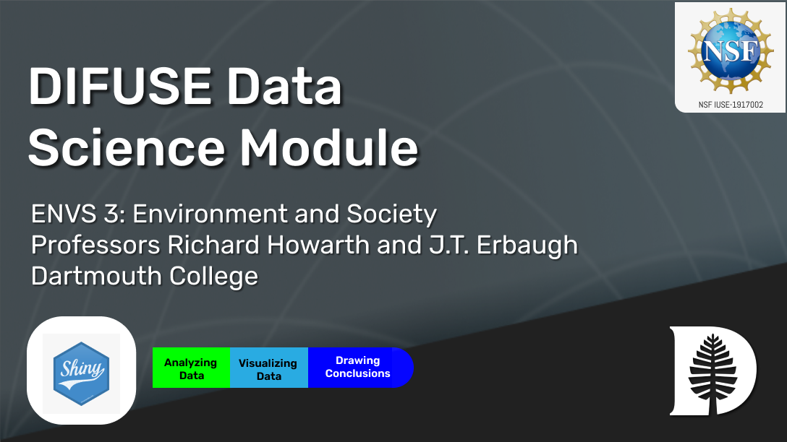

# Environmental Science: Environmental Impact on COVID Mortality DIFUSE Module

## Contributors: James Busch (GR), William Chen ('22), Richard Howarth (Professor of Enivronmental Science), J.T. Erbaugh (Lecturer in Quantitative Social Sciences), Laura Ray (DIFUSE PI, Professor of Engineering), Scott Pauls (DIFUSE PI, Professor of Mathematics), Tiffany Yu (Project Manager)

This module was developed through the DIFUSE project at Dartmouth College and funded by the National Science Foundation award IUSE-1917002.

| | <a rel="license" href="http://creativecommons.org/licenses/by-sa/4.0/"> </a>This work is licensed under a <a rel="license" href="http://creativecommons.org/licenses/by-sa/4.0/">Creative Commons Attribution-ShareAlike 4.0 International License</a>. |
|---------|----------|

# Module Overview
## Module Objective 
Give students exposure to data science through the analysis and visualization of data, and interpreting and communicating results in the context of examining the impact of environmental factors on COVID-19 mortality.

## Student Learning Objectives
1.	Apply data visualization methods and interpret the results.
2.	Generate and test hypotheses about relationships between different variables and health outcomes.
3.	Build and use models to predict outcomes.

## Module Description
Students use demographics and environmental data coupled with COVID-19 mortality data from four waves of the epidemic to examine impacts on mortality.  The environmental data focuses on the so-called "Cancer Alley" in Louisiana where environmental contamination has pushed cancer rates much higher than average.  Students use visualizations to build hypotheses and then test their proposed relationship by examining correlations and results from linear regression.

### Data
The module uses statistical data from Louisiana parishes including demographics, population characteristics, toxic emissions, and respiratory hazard, couple with mortality data from four COVID waves.

### Platform
The module is hosted as an application on <a href="https://envs3-app-yaex.onrender.com/">render</a>.  The underlying code is in python.

## Schedule and Links

Use this page to get an idea of the timeline of the module, what components are involved, and what documents are related to each component. This is the schedule intended for module deployment by the DIFUSE team, though instructors are welcome to modify the timeline to fit their course environment.

| Date             |  In/Out of Class | Assignment Description                     | Linked course content                                    | Assignment Files (Linked to Repository Contents) |
|------------------|-----------------|--------------------------------------------------|-------------------------------------------------|--------------------------------------------------|
| Week 1 | In class          |Introduction to modules, variables, techniques, and colab| | [Introductory materials](completed_module/components/assignment0/README.md) |

## Course Information
This module was developed for a environmental science course, <a href="http://dartmouth.smartcatalogiq.com/current/orc/Departments-Programs-Undergraduate/Environmental-Studies-Program/ENVS-Environmental-Studies/ENVS-3">Environment and Society</a>, at Dartmouth College which explores the interconnections and impacts between environmental and societal factors.  The course is introductory and draws students from different interests and backgrounds.
---

| | <a rel="license" href="http://creativecommons.org/licenses/by-sa/4.0/"> </a>This work is licensed under a <a rel="license" href="http://creativecommons.org/licenses/by-sa/4.0/">Creative Commons Attribution-ShareAlike 4.0 International License</a>. |
|---------|----------|

For instructors and interested parties, the history of this repository (with detailed commits), can be found [here](https://github.com/difuse-dartmouth/covid-wave-environmental-map-regression/commits/main/).

